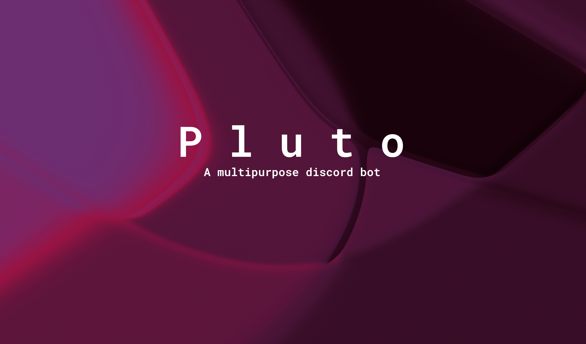

# 🌑 The Pluto Discord Bot

## What is the point of this project?
The point of this project is to provide a discord bot that is able to perform the duties of multiple discord bots while remaining one discord bot.

## Badges
Badges provided by [shields.io](https://shields.io/)  

## Building from source
Pluto uses Yarn v2 (codename berry) instead of NPM

### Pre-build instructions for both
2. Make sure you are using Yarn v2 by running `yarn set version berry` in the project root
3. Build all dependencies by using `yarn` in the project root

### Building Release

