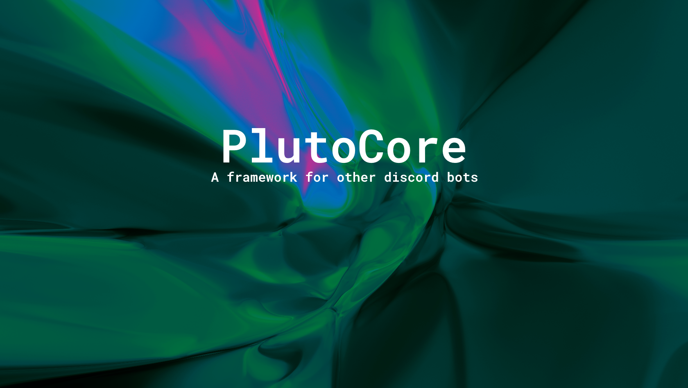

# 🌑 PlutoCore

## What is the point of this project?
The point of this project is to provide a discord bot framework that is able to expediate bot development.

## Badges
Badges provided by [shields.io](https://shields.io/)  

## Building from source
PlutoCore uses Yarn v2 (codename berry) instead of NPM

### Pre-build instructions for both release and debug
1. Run `npm i -g yarn` to insure that yarn is installed
2. Make sure you are using Yarn v2 by running `yarn set version berry` in the project root
3. Build all dependencies by using `yarn` in the project root
4. Create a *copy* of the `src/configuration/config_example.ts` and call it `config.ts` within the same folder
5. Populate the relevent fields, mainly `bot.ownerid`, `bot.token`, and `bot.canaryToken` (canary token is optional but recommended if you are developing)

### Building Release
1. Make sure `devOptions.canary` is set to false
2. Run `yarn run build`
3. Run `yarn start`
4. Profit
